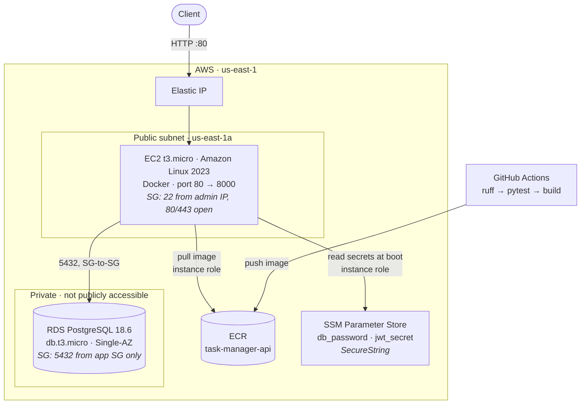

# Task Manager API

[](https://github.com/Lymah121/task-manager-api/actions/workflows/ci.yml)

A multi-user task manager built as a production-shaped backend service: JWT authentication,
owner-scoped CRUD, PostgreSQL with migrations, containerized, and deployed to AWS behind a
CI/CD pipeline.

**Live:** <http://54.243.235.27/health> · **API docs:** <http://54.243.235.27/docs>

> Running on EC2 with RDS PostgreSQL in a private subnet. HTTPS lands next; the address is
> plain HTTP for now, so don't send a password you use anywhere else. If the link is dead, the
> demo stack has been torn down — `deploy/teardown.sh` exists precisely so it doesn't bill
> forever, and everything needed to stand it back up is in this repo.

## The problem

Most task-manager demos are single-user CRUD with no authorization story. The interesting
part of the problem is the one they skip: when many users share a database, *user A must
never be able to read or modify user B's rows* — not by guessing an ID, not by crafting a
request, not through any endpoint. Every route in this API is scoped to the authenticated
owner, and there is a test that proves it.

### 401, 403, 404 — and why cross-tenant access is a 404

Every `/tasks` route resolves through a single dependency, `get_owned_task`, which loads a task
with `WHERE id = :id AND owner_id = :current_user`. Ownership is part of the query, not a check
performed after the fact, so there is no code path that can load a row belonging to another user.

When that query returns nothing, the API responds **404 Not Found** — whether the task never
existed or belongs to someone else. Returning 403 for the second case would be more literally
descriptive, but it would also confirm that a given task ID exists. With sequential integer IDs,
an authenticated user could then walk the ID space and learn how many tasks other accounts hold
and when they were created, without ever reading one. 404 makes "not yours" and "doesn't exist"
indistinguishable from the outside.

| Code | Meaning | Trigger |
|---|---|---|
| **401** | I don't know who you are | token missing, malformed, tampered with, or expired |
| **403** | I know who you are, and you may not use this API | authenticated but deactivated account |
| **404** | As far as you are concerned, this row does not exist | task missing, *or* owned by someone else |

403 is reserved for the case where the client's identity *is* the problem and hiding it gains
nothing. 401 never says *which* of the four token failures occurred.

`tests/test_authorization.py` proves all of it, including that another user's task and a
nonexistent one return byte-identical responses, and that user B's task is unchanged after user A
attempts to `PATCH` and `DELETE` it — a 404 alone would only prove the *response* was denied.

## Stack

| Layer | Choice |
|---|---|
| Language | Python 3.14 |
| Framework | FastAPI |
| Database | PostgreSQL 18 (SQLAlchemy 2.0 + Alembic) |
| Driver | psycopg 3 |
| Auth | JWT bearer tokens (PyJWT), Argon2 password hashing (pwdlib) |
| Tests | pytest, against real PostgreSQL |
| Lint | ruff |
| Container | Docker (multi-stage, non-root) |
| CI | GitHub Actions |
| Hosting | AWS EC2 + RDS |

## Architecture



The two things worth pointing at in an interview:

**The database has no public IP.** `PubliclyAccessible: false`, and its security group's only ingress rule references the app's security group — there is no CIDR in it at all. Nothing on the internet can reach Postgres, whatever it knows about the endpoint.

**No secret is on the instance or in its user-data.** EC2 user-data is readable forever by any process on the box through the metadata service, so the database password and JWT signing key live in SSM Parameter Store as `SecureString` and are fetched at boot by the instance role. The role can read `/taskmanager/*` and nothing else.

## Running it locally

```bash
git clone https://github.com/Lymah121/task-manager-api.git
cd task-manager-api

cp .env.example .env
# then set JWT_SECRET:  python -c "import secrets; print(secrets.token_urlsafe(32))"

docker compose up -d db          # PostgreSQL 18 on host port 5433

python -m venv .venv
source .venv/bin/activate        # Windows: .venv\Scripts\activate
pip install -r requirements-dev.txt

python -m alembic upgrade head
python -m uvicorn app.main:app --reload
```

Interactive API docs are then at `http://127.0.0.1:8000/docs`. Log in through the **Authorize**
button — `/auth/login` uses the OAuth2 password flow, so the whole authenticated surface is
usable from the browser.

Run the checks the pipeline runs:

```bash
ruff check .
python -m pytest -v
```

> Commands use `python -m ...` throughout. That form is identical to the bare console scripts but
> immune to the antivirus policies that block `pytest.exe` / `alembic.exe` on some Windows setups.

**Port 5433, not 5432.** The Compose file publishes Postgres on 5433 so it cannot collide with a
native Postgres install on the host. CI uses 5432 inside the runner, where nothing else is bound.

**Tests need `taskmanager_test`.** It is created automatically the first time the `pgdata` volume
is initialised. If you added the init script to an existing volume, create it by hand with
`docker compose exec db createdb -U app taskmanager_test`.

## API

| Method | Path | Auth | Description |
|---|---|---|---|
| `GET` | `/health` | — | Liveness probe. Returns `{"status": "ok"}`. |
| `POST` | `/auth/signup` | — | Create an account. `409` if the email is taken. |
| `POST` | `/auth/login` | — | OAuth2 password form → access + refresh token. |
| `POST` | `/auth/refresh` | — | Exchange a refresh token for a new pair (rotating). |
| `POST` | `/auth/logout` | — | Revoke one refresh token. |
| `POST` | `/auth/logout-all` | Bearer | Revoke every session for the caller. |
| `POST` | `/tasks` | Bearer | Create a task owned by the caller. |
| `GET` | `/tasks` | Bearer | List the caller's tasks. Supports `status`, `limit`, `offset`. |
| `GET` | `/tasks/{id}` | Bearer | Read one of the caller's tasks. |
| `PATCH` | `/tasks/{id}` | Bearer | Partial update; unset fields are left alone. |
| `DELETE` | `/tasks/{id}` | Bearer | Delete one of the caller's tasks. `204`. |

### Postman

`docs/task-manager-api.postman_collection.json` — import it, run **Auth → Signup** then
**Auth → Login**. The login request captures `access_token` into a collection variable, so every
request under **Tasks** is authenticated automatically. Each request carries assertions, so the
folder can be run end to end.

## Design notes

**Schema has one source of truth.** There is no `create_all()` at startup; the schema comes from
the Alembic chain, and the test suite builds its database by running those migrations rather than
from the models — so the migrations are themselves under test. `test_models_match_migrations`
fails the build if a model is edited without a matching revision.

**Task status is `VARCHAR` + `CHECK`, not a native Postgres enum.** Adding a value to a native
enum needs `ALTER TYPE ... ADD VALUE` and removing one is effectively impossible; Alembic
autogenerate detects neither. A CHECK constraint changes with ordinary, reversible DDL.

**Timestamps are `TIMESTAMPTZ`, defaulted by the database.** `server_default=func.now()` means
the database clock stamps rows, so a skewed application server cannot write out-of-order times.

**Refresh tokens rotate, and reuse is treated as theft.** Access tokens live 15 minutes;
the long-lived session is a refresh token stored only as a SHA-256 hash. Each one is
single-use, and presenting one that was already *rotated* revokes every session for that
user, on the reasoning that we cannot tell the thief from the victim. Crucially, a token
revoked by an explicit **logout** does not trigger that — replaying it is a stale client,
not an attack, and burning the user's other devices over it would be a bug. `RevocationReason`
records which case applied.

**Duplicate signups are caught by the unique index**, not a pre-flight `SELECT` — checking first
is a TOCTOU race where two concurrent signups both see the email as free.

**Tests run against real PostgreSQL**, not SQLite. Each test executes inside a transaction bound
to a single connection and rolled back afterwards, so endpoint `commit()` calls behave normally
while tests stay isolated and fast.

## Deployment

The image is built by CI, pushed to ECR, and run on a single EC2 instance behind an Elastic IP.

```bash
docker build --platform linux/amd64 --target runtime -t <account>.dkr.ecr.us-east-1.amazonaws.com/task-manager-api:latest .
docker push <account>.dkr.ecr.us-east-1.amazonaws.com/task-manager-api:latest

# On the instance, or via SSM Run Command:
sudo systemctl restart taskmanager
```

`deploy/user-data.sh` provisions the host: installs Docker, writes `/opt/taskmanager/run.sh`
and a `taskmanager.service` systemd unit, then starts it. The run script resolves the RDS
endpoint, pulls the image, and starts the container. The container's entrypoint applies
`alembic upgrade head` before uvicorn starts, so a fresh instance converges the schema itself.

Access to the box is through **SSM Session Manager** (`aws ssm start-session --target <id>`)
rather than a stored SSH key. Port 22 is open only to a single admin IP as a fallback.

### Cost, honestly

This account is past its 12-month free tier, so the deployment is not free:

| Resource | Rate | ~1 month |
|---|---|---|
| EC2 t3.micro | $0.0104/hr | $7.59 |
| RDS db.t3.micro Single-AZ | $0.0180/hr | $13.14 |
| RDS storage, 20 GB gp2 | — | $2.30 |
| Elastic IP (billed even when attached, since Feb 2024) | $0.005/hr | $3.65 |
| EBS root, 8 GB gp3 | — | $0.64 |
| **Total** | | **~$27** |

`deploy/teardown.sh` deletes every billable resource. It runs as a dry run by default and
only acts with `--yes`.

## Status

Days 1–2 of 6 complete. Auth, the task domain, migrations and a 34-test suite are in; the service
is containerized, built by CI and running on AWS at the address above.

Next: HTTPS via Caddy, JWT refresh tokens, CloudWatch log shipping, an ALB with an auto scaling
group, and continuous delivery on merge to `main`.

## What I would do next

To be written once the service is deployed — the honest version, including what is configured but
not yet load-tested.
